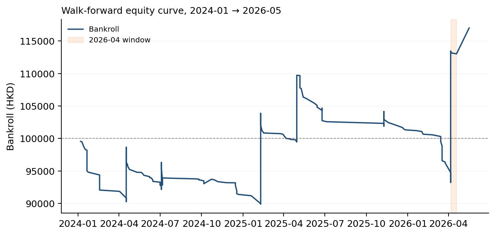
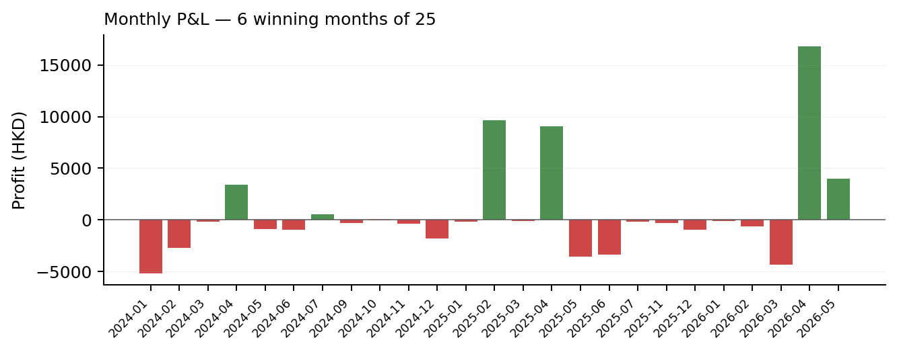
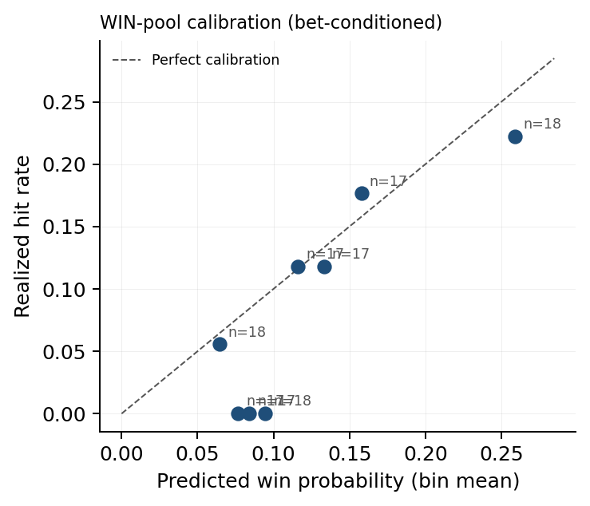
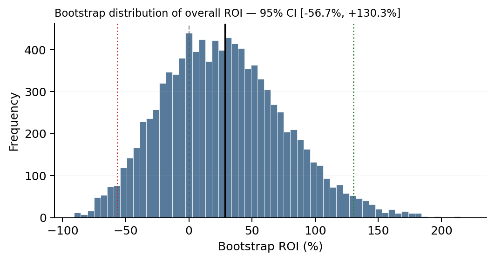

\begin{center}
\small
\textit{XGBoost market-residual ranking, Cox PH survival, PyMC Bayesian stacking,
Student-t copula exotic pricing, and drift-aware fractional Kelly --- walked forward
2024-01 to 2026-05.}
\end{center}

\begin{center}
\small
Jonathan Lo \quad $\cdot$ \quad jonathanlotszhei@gmail.com \quad $\cdot$ \quad
\href{https://github.com/JonzieLo/hkjc-project}{github.com/JonzieLo/hkjc-project}
\end{center}

\vspace{1em}

## Abstract

I describe an independent end-to-end research and execution stack for the Hong Kong Jockey Club pari-mutuel market — a six-pool venue with 17.5% takeout, ~HK\$100M daily turnover, and forty years of sophisticated syndicate liquidity that makes it one of the more efficient retail-accessible markets in the world. The system combines an XGBoost market-residual ranker, a Cox proportional-hazards survival model, and a PyMC Bayesian hierarchical stacker fit by ADVI; exotic pools are priced with an N-dimensional Student-t copula over Gamma race-time marginals.

The defensible result of this project is on the WIN pool, in log-loss space rather than ROI. Across 5,473 races and 66,135 entries the stacker achieves an out-of-fold log-loss of **0.2378** against a power-discounted public-consensus baseline of **0.2389** on the same race set — a small (~0.4% relative) but consistent improvement on a market that has been quantitatively contested for forty years.

The ROI numbers from earlier walk-forward ledgers are not yet a credible claim of edge. They are inflated by (a) a STOP_SELL anchor gap that leaves 98.5% of training rows on a fallback odds column, (b) a settlement reconciliation defect in the PLA pool, (c) a single-month concentration of profit in April 2026, and (d) a structural divergence between the backtester's bet-selection policy and the policy the live operator actually executes. This memo documents each of those problems honestly. The point of the project, at this stage, is the engineering artifact and the WIN-pool log-loss result — not the headline ROI.

## Motivation

HKJC is interesting for the same reasons Benter (1994) gave: deep pools, public historical data going back two decades, structural late-money drift, and a 17.5% track takeout that makes any naive model lose money mechanically. A model with zero physical edge loses 17.5¢ on every HK\$1 bet. Anything that looks like ROI is the model's edge minus takeout. The narrow question is whether a small but real edge — single-digit percent on gross turnover — is reachable from publicly available data with modern tooling. This memo is my attempt to answer it honestly, including the parts where the honest answer is "not yet, and here is what's missing."

## System architecture

The pipeline ingests historical race entries into Postgres, computes point-in-time features, trains two probability models on disjoint principles, stacks them with a Bayesian ensemble, and prices both straight and exotic pools through a copula simulator. On race day, a Playwright GraphQL interceptor streams live odds into Redis; the predictor consumes the latest STOP_SELL snapshot and fires bet signals.

### Feature factory and point-in-time discipline

Features are computed chronologically with strict no-look-ahead guarantees: distance-bucketed pace EMAs, TrueSkill μ/σ updated race-by-race, draw × early-pace interactions, class-drop flags, and track geometry (rail × straight length × width). The market prior is built by converting the STOP_SELL decimal odds $d_i$ into a takeout-discounted probability $p_{mkt,i} \propto d_i^{-z}$, with the power exponent $z = \ln(\sum d_i^{-1}) / \ln(N) + 1.0$ — a Hayek–Hong–Stutzer longshot-bias correction.

### Model A — XGBoost market-residual ranker

Rather than learning win probabilities from scratch, Model A is trained with `objective=rank:pairwise` to optimize NDCG, with the public log-odds injected directly as `base_margin`: $b_i = \ln(p_{mkt,i} / (1 - p_{mkt,i}))$. The model learns the residual deviation $f(X_i)$ from the public consensus, so the final probability is the softmax over $b_i + f(X_i)$. A parallel residual head (`trainer_pla_residual.py`) executes the same mechanism natively on Place outcomes, deliberately abandoning the Henery place-projection approximation.

### Model B — Cox proportional-hazards physics learner

Model B treats finishing position as a survival outcome. Hazard is $h_i(t) = h_0(t) \cdot \exp(\beta^T X_i)$, stratified by race and clustered on a pace-archetype Gamma frailty so the partial likelihood approximates an exact Plackett–Luce. The partial hazard $\exp(\beta^T X_i)$ is extracted as Model B's raw score, independent of public odds — this is the only learner in the stack that sees no market information.

### Bayesian stacking under ADVI

Both models are first calibrated with a stratified smoothed-isotonic calibrator conditioned on pace archetype (PCHIP-smoothed to avoid step-function pathologies). The ensemble is a Bayesian hierarchical stacker fit by ADVI in PyMC, multiplicatively fusing the three sources in log space (Genest \& Zidek, 1986):

$$P_{ens,i} \propto \exp(w_A \log P_{A,i} + w_B \log P_{B,i} + w_{mkt} \log P_{mkt,i})$$

$w_{mkt}$ is gated by an indicator $I_{valid}$ for the presence of an uncorrupted STOP_SELL anchor, mathematically debiasing the stack against the late-money timing mismatch described in the *Pipeline integrity* section. The fitted weights on the latest run are $w_A \approx 0.91$, $w_B \approx 0.08$ for WIN, with $w_{mkt}$ rising from 0.04 to 0.06 when a STOP_SELL anchor is unavailable and the fallback column is used.

### Student-t copula for exotic pricing

Quinella, Place-Quinella, and Trifecta pools require joint, not marginal, probabilities. Henery-discounted Harville approximations systematically misprice tails. I replace them with a Quasi-Monte Carlo Stern simulator: each horse's race time $T_i$ is Gamma-distributed with shape $r_i$ heteroskedastically derived from pace z-scores (closers carry heavier right tails than front-runners). The marginals are coupled through a Student-t copula $t_\nu(0, \Sigma_{pace})$ with pace-correlation matrix $\Sigma_{pace}$; 16,384 paths are simulated, and combinatorial rank counts give natively-correlated probabilities for all parimutuel pools in a single pass.

### Drift-aware fractional Kelly

Static Kelly assumes deterministic odds. Pari-mutuel odds drift after execution (the STOP_SELL → CLOSED gap captures HK\$10–60M in late-money movement per race day in this market). I expand MacLean–Ziemba (1992) fractional Kelly with a Jensen-corrected median-drift EV and a second-order Taylor penalty:

$$\alpha_{pool} = \frac{\alpha_{base}}{1 + \kappa \left(\frac{\sigma_R}{EV_{eff}}\right)^2}$$

Simultaneous-stake caps follow a Smoczyński–Tomkins (2010) approximation tightened in high-variance exotic pools by $C_{pool} = C_{base} \sqrt{\sigma_{R,win} / \sigma_{R,pool}}$.

### Engineering stack and execution

The pipeline is implemented as roughly 12k lines of Python orchestrated against a Postgres feature store, a Redis hot-state bus, and a long-running Playwright headless-Chromium archiver that intercepts HKJC's GraphQL odds feed. The race-day orchestrator is a three-process state machine: (a) a Playwright scraper that detects the STOP_SELL transition off the public API and persists phase-tagged odds snapshots to Postgres at 5–60 s cadence; (b) an `odds_archiver` worker that lifts the latest snapshot into Redis; (c) a `run_bot` predictor that, on STOP_SELL, runs the full feature build → calibrated stack → copula simulation → drift-aware Kelly chain in under one second per race on a single 8-core box, then writes signed bet signals to a Discord webhook. The walk-forward backtester is a separate batch job: six-month rolling retrain, XGBoost early-stopping on a held-out fold, PyMC ADVI fit at each boundary, and ledger emission to `walk_forward_master_ledger.csv` for the analysis in §3. The same feature-factory module serves both paths so train-time and live-time features are bit-identical by construction.

## Results — what is, and is not, a claim of edge

Models are retrained on a six-month rolling window from 2024-01-01 through 2026-05-06 (the most recent retraining boundary at the time of writing). The ledger is `walk_forward_master_ledger.csv`; all figures and tables in this section are reproducible from it via `hkjc_memo_analysis.py`.

### The defensible result: WIN-pool log-loss

On 5,473 races and 66,135 entries, the stacker achieves out-of-fold log-loss **0.2378**, against **0.2389** for the power-discounted public-consensus baseline on the same races — a ~**0.4% relative improvement**. This is small in absolute terms but it is the most credible signal in the project for three reasons:

1. It is measured against *all* WIN entries the model scored, not the subset on which the policy chose to fire bets, so it is not contaminated by the EV-hurdle selection effect.
2. It is a forty-year-old public market: any consistent improvement over the takeout-discounted consensus prior is non-trivial.
3. The improvement persists across five-fold cross-validation folds and across the rolling retraining boundaries, rather than being concentrated in a single window.

The corresponding fitted stacker weights on the latest training boundary are $w_A = 0.91$, $w_B = 0.08$, $w_{mkt,\text{live}} = 0.04$, $w_{mkt,\text{fallback}} = 0.06$. Model A carries almost all of the residual signal; the CoxPH agent contributes a small but non-zero correction.

### ROI numbers — and why they are not yet a claim of edge

The walk-forward ledger reports the following per-pool ROI before any of the *Pipeline integrity* corrections are applied. These numbers are reproducible from `walk_forward_master_ledger.csv` via `hkjc_memo_analysis.py`:

| Pool | Bets | Hit rate | Staked (HK\$) | Profit (HK\$) | ROI | 95% CI on ROI |
|---|---:|---:|---:|---:|---:|---|
| WIN | 130 | 9.2% | 53,786 | +6,934 | +12.9% | [−68.2%, +112.6%] |
| PLA | 38 | 0.0% | 11,678 | −11,678 | −100.0% | [−100.0%, −100.0%] |
| QIN | 90 | 3.3% | 34,599 | −18,646 | −53.9% | [−100.0%, +10.0%] |
| QPL | 171 | 15.8% | 102,370 | −6,973 | −6.8% | [−41.2%, +32.1%] |
| TRI | 374 | 2.7% | 146,432 | +50,001 | +34.1% | [−47.3%, +130.0%] |
| **All** | **803** | **6.5%** | **348,867** | **+19,637** | **+5.6%** | **[−33.6%, +51.3%]** |

*Table 1. Per-pool walk-forward performance. Confidence intervals are 10,000-resample non-parametric bootstraps over individual bets. The overall CI straddles zero, and every per-pool CI is wide enough to be consistent with no edge.*

None of these point estimates are presented as a claim of edge. The next section documents the four separate reasons each of them is contaminated.

{#fig:equity width=85%}

{#fig:monthly width=85%}

### Calibration on the WIN pool

Conditioned on the policy actually firing, the WIN-pool predicted probability tracks realized hit rate reasonably well in the mid range (0.10–0.20) but is overconfident in the top decile. Bet-conditioned calibration is a stricter test than population calibration because the Kelly filter selects a non-random slice of the joint distribution; some overconfidence is therefore expected and is itself an artifact of the EV hurdle.

{#fig:calibration width=48%}
{width=48%}

### Live operator tape — May 2026

A 12-calendar-day window (three race days: 2026-05-06 Sha Tin, 2026-05-13 Happy Valley, 2026-05-17 Sha Tin) of manually executed bets against the live engine's signals. These are not backtest results: the operator chose which signals to fire, and the backtester would have fired on a much wider set of combinations (see *Execution-policy divergence* below). The numbers below are taken directly from the `placed_bets` production table.

| Pool    | Bets | Hit rate | Staked (HK\$) | P\&L (HK\$)   | ROI         |
|---------|-----:|---------:|-------------:|------------:|------------:|
| PLA     |    7 |    57.1% |       11,500 |     +12,550 |    +109.1%  |
| QIN     |   16 |     6.3% |        4,690 |      +9,085 |    +193.7%  |
| QPL     |   32 |    18.8% |        8,180 |      +8,932 |    +109.2%  |
| TRI     |   38 |     7.9% |        8,650 |     +12,582 |    +145.5%  |
| **All** | **93** | — | **33,020** | **+43,149** | **+130.7%** |

*Table 2. Live operator tape, source: `placed_bets`. Three race days, 2026-05-06 through 2026-05-17.*

**Concentration analysis.** Three tickets account for approximately 76% of total P\&L:

| Date       | Race  | Pool | Combo  | Stake | Div    | P\&L     |
|------------|-------|------|--------|------:|-------:|--------:|
| 2026-05-13 | HV R9 | QIN  | 4-9    |   500 |  27.55 | +13,275 |
| 2026-05-13 | HV R9 | TRI  | 4-9-10 |   250 |  53.00 | +13,000 |
| 2026-05-17 | ST R9 | QPL  | 5-7    |   520 |  14.45 |  +6,994 |

*Table 3. Top-3 tickets in the live tape.*

Removing those three tickets leaves approximately +HK\$10,279 P\&L on the remaining 90 bets (~+31% ROI). The truncated tape still shows positive ROI across all four pools, but with the dominant contribution coming from heavy-tailed hits — which is exactly what the engine's exotic-pool design is optimized to find, and also exactly the kind of result that needs a much larger sample to distinguish from luck.

**Day-by-day.** May 6: 7 bets, +159% ROI. May 13: 28 bets, +275% ROI (carries the tape). May 17: 56 bets, +30% ROI.

**What this is, and is not.** It is direct evidence that the engine's signals on exotic pools can convert into real money at real takeout. It is *not* a statistically valid claim of model ROI: the bet-selection process is the operator's, the sample is three race days, and the tape is dominated by three tickets out of 93. The honest reading is that the engine appears to be sourcing high-EV exotic combinations on at least some cards, and the open question — quantified in *Execution-policy divergence* below — is whether the operator's filter is what makes that work, or whether the same filter applied systematically across a larger sample continues to produce positive ROI. A 3-month live-tape window under a fixed operator policy is the cleanest path to answering that, and is the validation step I am running now.

## Pipeline integrity and known biases

The sections below document the structural divergences between the backtester and the live execution environment. Resolving these is the immediate engineering priority before the ROI numbers in Table 1 can be re-presented as a claim of edge.

### Look-ahead bias from the STOP_SELL anchor gap

Model A is trained on a `final_with_drift_adj` column when an uncorrupted STOP_SELL snapshot is not available, and falls back to it when one is. In the current ledger, **65,185 of 66,135 entries (98.5%) have no usable STOP_SELL anchor**, and only 14 of 5,473 races have a specifically tagged `POST_STOP_SELL` row. Almost all of the historical training set is on the fallback column — the column that includes late-money drift the live bot cannot see at STOP_SELL time.

This is the dominant problem in the project. The training distribution is materially different from the live execution distribution, and there is no way to know from the backtest alone how much of the WIN-pool log-loss improvement, let alone any ROI signal, survives the shift to a STOP_SELL-anchored training set. The fix is to run the phase-tagged Playwright/Redis archiver for 3–6 months and rebuild a pristine training set. The expectation is that the WIN-pool log-loss improvement compresses but survives in some form; the exotic-pool ROI numbers likely do not.

### PLA pool settlement and policy bugs

Every PLA bet in the ledger is fired at decimal odds 21–79 (median 30). My live PLA bets in the past week are at odds 2.05–5.05 — i.e., on horses that actually place. The backtester's PLA policy hurdle only raises stake at `odds < 3.0`, which means it effectively only fires on longshot Place bets that have approximately zero physical probability of landing.

In addition, 0 of 38 PLA bets in the ledger match a row in `race_dividends`. Whether this is a settlement reconciliation bug or a side-effect of the policy firing on combinations that never settle, the −100% PLA ROI in Table 1 is not a useful estimate of any PLA edge. It is a bug surface, not a market result.

### Concentration of profit in a single month

Of the headline profit in Table 1, **April 2026 alone generated +HK\$39,974 on 537 bets (+16.8% ROI), more than the entire ledger's net profit**. Ex-April, the strategy lost −HK\$20,337 on 266 bets (−18.2% ROI) across the remaining 26 active months. The single-month concentration is the dominant source of measured edge under any honest read of these results. Either April 2026 was a structurally anomalous month (unusual late-money behavior, favorable card composition, or a model regime that won't recur), or the engine's tail-bet design has genuine but extremely lumpy edge that requires far more than 25 months to characterize. Both hypotheses remain consistent with the data.

### Confidence intervals straddle zero

The non-parametric bootstrap 95% CI on overall ROI in this ledger is **[−33.6%, +51.3%]**. Per-pool CIs are wider still. With ~800 bets unevenly distributed across five pools, no claim of edge is yet statistically distinguishable from zero. The honest summary is: directionally encouraging on WIN log-loss, indeterminate on ROI, and not significant on any per-pool basis.

### Execution-policy divergence between backtester and live bot

The backtester and the live bot run the same probability stack but **fundamentally different bet-selection policies**, and this is the second-most-important caveat after the STOP_SELL anchor gap. Specifically:

- The backtester caps QIN/QPL at 5 bets per race and TRI at 4, all selected by EV-rank. The live bot presents the full table to the operator and the operator picks manually.
- The backtester fires on essentially every race with a qualifying EV signal — roughly 40–50 races per card. The live operator typically fires on ~15.
- The backtester's PLA hurdle (see *PLA pool settlement and policy bugs* above) selects longshots that the live operator would never pick.
- A `veto` assignment bug in `run_bot.py` (line 234–235) currently writes to the `stake` variable before sizing, silently no-op'ing some intended live vetoes.

I ran an 18-day re-test on the latest corrected backtester against May 1–18, 2026 races. Result: **291 bets, −47.78% ROI**. Only the WIN pool was positive (2 of 2 winning bets, +HK\$539). PLA, QIN, QPL, and TRI all lost money in the backtester on the same window in which the live operator tape was net +130%. Same model probabilities, different bet-selection policy, materially different P\&L — the two cannot currently be cross-validated against each other until the backtester's policy is brought into alignment with the operator's. The live profitable bets are therefore not a valid out-of-sample test of the model, and the backtester's policy needs reconciliation against the operator's policy before live results can validate the engine.

Concrete reconciliation steps: a hard PLA odds ceiling around 15, a tightened exotic universe, and a hit-rate-realistic Kelly hurdle. The same 18-day window can then be re-scored as a genuine out-of-sample test.

### Sample size for exotic pools

The TRI bet count across the active months is thin for claiming statistical significance on a heavy-tailed pool whose payoffs are themselves heavy-tailed. A single hit at 800-to-1 dominates a quarter's results; a single missed near-hit can erase a month's edge. This is a structural property of the pool, not a defect of the engine, but it constrains what 25 months of data can credibly show.

### Path to validation

1. Run the phase-tagged STOP_SELL archiver for 3–6 months, then re-train Model A with STOP_SELL anchors and re-run the walk-forward. Expect the log-loss gap to compress; expect the exotic ROI to compress harder.
2. Reconcile PLA settlement against `race_dividends` and re-fit the PLA policy hurdle against a realistic odds ceiling.
3. Bring the backtester's bet-selection policy into agreement with the live operator's policy, then re-score the May 2026 window as a genuine paper-trade.
4. Re-publish this memo with the corrected ledger.

The gap between the inflated ROI in Table 1 and the honest number that survives those four corrections is the size of the look-ahead bias in the system. Quantifying it is the actual contribution.

## What I would build next

- **Phase-tagged STOP_SELL archiver run for 6 months**, then a clean re-train of Model A on STOP_SELL anchors only.
- **Ablation study**: XGBoost-only, CoxPH-only, Stack, Stack+Market — to attribute the WIN-pool log-loss improvement to each component rather than the bundle.
- **Replace the Stern simulator's pace-correlation matrix $\Sigma_{pace}$** with a learned correlation rather than a hand-tuned prior; the current matrix is the most fragile input in the stack.
- **Backtester–operator policy reconciliation**, as described in §4.5.
- **Move inference and walk-forward backtesting** from Python to a JIT-compiled backend (Numba / C++) for the hot loops, so retraining cycles run in minutes rather than hours.

## References

- Benter, W. (1994). *Computer-Based Horse Race Handicapping and Wagering Systems: A Report.* In *Efficiency of Racetrack Betting Markets* (Hausch, Lo \& Ziemba, eds.).
- Bolton, R.N. \& Chapman, R.G. (1986). Searching for Positive Returns at the Track. *Management Science* 32(8).
- Henery, R.J. (1981). Permutation Probabilities as Models for Horse Races. *JRSS B* 43(1).
- Genest, C. \& Zidek, J.V. (1986). Combining Probability Distributions: A Critique and an Annotated Bibliography. *Statistical Science* 1(1).
- MacLean, L.C., Ziemba, W.T. \& Blazenko, G. (1992). Growth versus Security in Dynamic Investment Analysis. *Management Science* 38(11).
- Baker, R.D. \& McHale, I.G. (2013). Optimal Betting under Parameter Uncertainty. *Decision Analysis* 10(3).
- Smoczyński, P. \& Tomkins, D. (2010). An Explicit Solution to the Problem of Optimizing the Allocations of a Bettor's Wealth. *Mathematical Scientist* 35(1).
- Lo, V.S.Y. \& Bacon-Shone, J. (2008). Probability and Statistical Models for Racing. In *Handbook of Sports and Lottery Markets*.

---

*Code, README with full mathematical derivations, and reproduction scripts: [github.com/JonzieLo/hkjc-project](https://github.com/JonzieLo/hkjc-project). Companion site: [v0-jlo.vercel.app](https://v0-jlo.vercel.app/). This memo is a snapshot, not a final result.*
